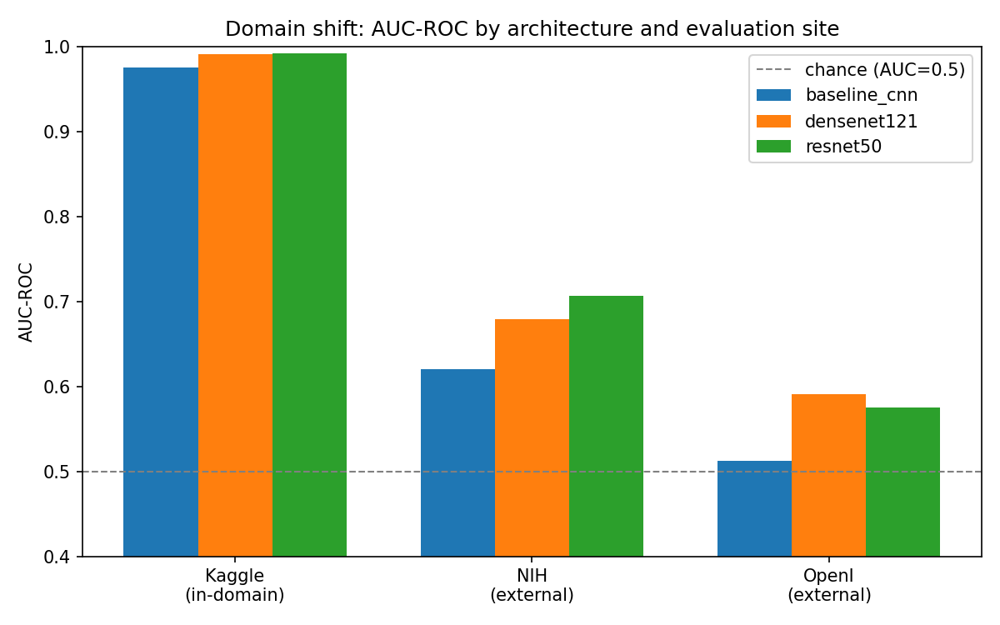
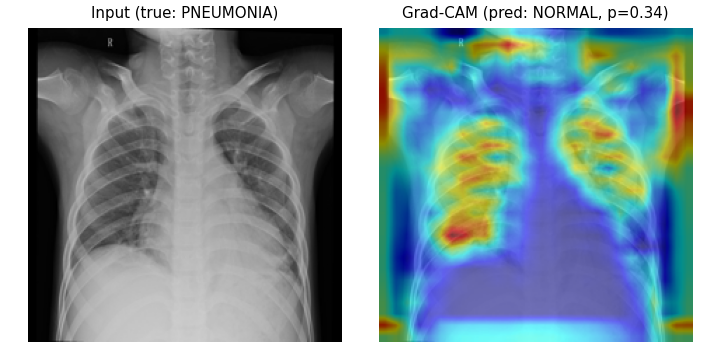
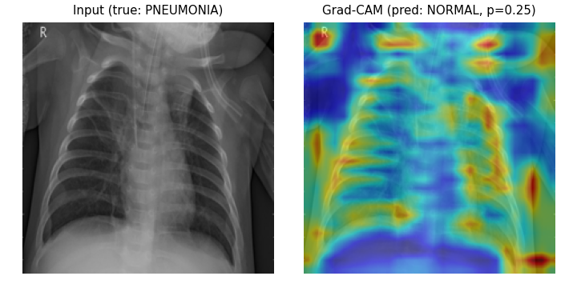
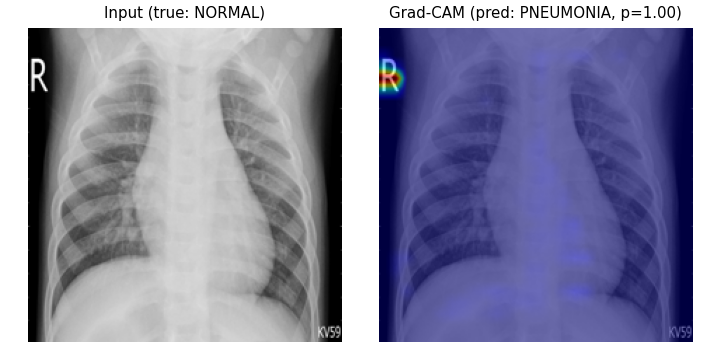
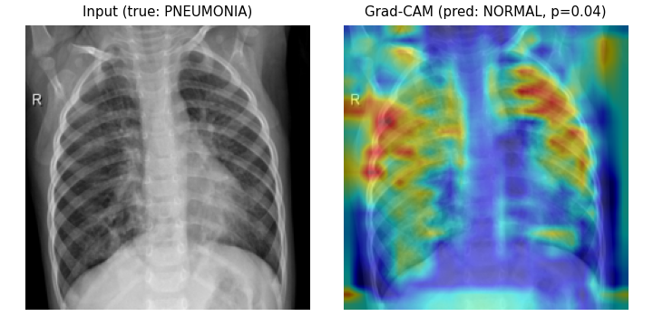
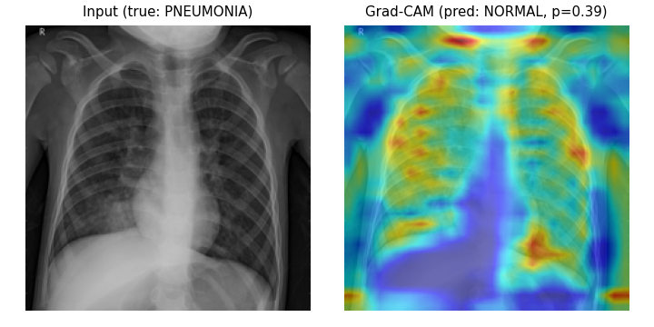

# Chest X-Ray Domain-Shift and Shortcut-Learning Audit

*A pneumonia classifier that scores well in the hospital it was trained in
and shows, quantitatively, why it should not be trusted anywhere else.*

## 1. Overview and relevance

Deep learning models for medical imaging routinely reach high in-distribution
accuracy and then fail silently once deployed outside the hospital system
they were trained on. This is a documented failure mode, not a hypothetical
one: Zech et al. (2018) showed a CNN trained to detect pneumonia had partly
learned to recognize hospital-specific scanner artifacts and text markers
rather than pathology, and DeGrave et al. (2021) found the same
shortcut-learning behavior in COVID-19 chest X-ray classifiers.

This project is a targeted replication and extension of that
generalization-failure literature. Three architectures — a custom CNN
trained from scratch, a fine-tuned ResNet-50 (He et al., 2016), and a
fine-tuned DenseNet-121 (Huang et al., 2017) — were trained on a
single-institution pediatric dataset (Kaggle's Chest X-Ray Images) and
evaluated, without retraining, on two independent adult-population external
sites (NIH ChestX-ray14 and Indiana University/OpenI). The central question
isn't "how accurate is the model," but *why* accuracy collapses under
domain shift, and whether that collapse is explained by a specific,
testable mechanism rather than treated as an unexplained black box.

### 1.1 Related work

This project sits at the intersection of four literatures. **Architecture**:
ResNet (He et al., 2016) and DenseNet (Huang et al., 2017) are the two
transfer-learning backbones evaluated here, chosen because they represent
distinct design philosophies — residual connections versus dense feature
reuse — that could plausibly generalize differently under domain shift.
**Generalization failure**: Zech et al. (2018) and DeGrave et al. (2021),
discussed above, motivate the entire premise. **Interpretability**: Grad-CAM
(Selvaraju et al., 2017) is the attention-visualization method underlying
every Grad-CAM figure and the quantitative shortcut metric in this report;
the shortcut metric's contribution is comparing that attention against a
segmentation ground truth across a full test set, rather than presenting a
gallery of hand-picked heatmaps as qualitative evidence. **Algorithmic
fairness in healthcare**: Obermeyer et al. (2019) showed a widely deployed
healthcare risk-prediction algorithm exhibited significant racial bias
because it used healthcare cost as a proxy for healthcare need — a
different mechanism than shortcut learning, but the same underlying lesson:
a model's measured performance metric can look acceptable while the
mechanism producing it is not clinically trustworthy, and only a targeted
audit surfaces the difference. See §10 for full references.

## 2. Research questions

1. How accurately can CNN-based architectures detect pneumonia on the
   Kaggle dataset, and what are the primary sources of misclassification?
2. How does performance degrade under domain shift — a model trained on one
   institution's data, tested on two independent external sites?
3. Do different architectures (custom CNN, ResNet-50, DenseNet-121) differ
   meaningfully in sensitivity, specificity, and generalization?
4. Is the model attending to medically plausible lung regions, or exploiting
   shortcut features — measured quantitatively across the full test set,
   not eyeballed from a handful of examples?
5. Does shortcut reliance correlate with pediatric-vs-adult imaging protocol
   specifically, or with a more directly measurable proxy (image
   resolution, detected text markers)?
6. What are the ethical and practical implications of deploying such a
   model clinically, given its measured failure modes?

## 3. Data sources

**Training**: [Kaggle Chest X-Ray Images (Pneumonia)](https://www.kaggle.com/datasets/paultimothymooney/chest-xray-pneumonia)
— 5,856 usable images (after removing corrupted files found during
verification), single institution (Guangzhou Women and Children's Medical
Center), pediatric population. The Kaggle-provided train/test split is
**not used as-is**: patient IDs are parsed directly from filenames (e.g.
`person1946_bacteria_4874.jpeg`) and the dataset is re-split at the patient
level, since the official split places images from the same patient in
both train and test, a known leakage risk in this dataset. The resulting
split has 4,416 train / 560 validation / 880 test images, with zero patient
overlap across splits (verified programmatically, not assumed).

**External validation only, never trained on**:

- **NIH ChestX-ray14** — 112,120 images, second institution, adult
  population. 61,792 examples usable after label harmonization.
- **Indiana University/OpenI** — 7,470 images from Indiana University
  Health, third institution, adult population, public with no access
  agreement. 2,854 examples usable after harmonization.

The proposal originally specified CheXpert as the third site. Stanford has
since moved CheXpert access behind an AIMI membership plus a signed
Research Agreement, both requiring manual institutional review with no
fixed timeline — impractical within this project's schedule. VinDr-CXR
(via its Kaggle competition packaging) was investigated as an alternative
and ruled out on two independent grounds: the competition's raw-DICOM
package is 142GB, and — more fundamentally — its 14-class taxonomy does not
include a Pneumonia label at all (only the original VinDr-CXR research
release's 28-label version does, which was the source of an initial,
incorrect assumption that it would transfer). Indiana University/OpenI was
selected after directly verifying, against the dataset's own XML reports
and a third-party loader's source code rather than a paper abstract, that
it carries a genuine Pneumonia label.

## 4. Label harmonization protocol

Kaggle, NIH, and OpenI do not share a native binary pneumonia label.
Treating them as compatible without a stated mapping would be the single
biggest credibility gap in a domain-shift claim, so the mapping is made
explicit here.

- **Kaggle**: already binary (NORMAL / PNEUMONIA) — used as-is, subject to
  the patient-level re-split described above.
- **NIH ChestX-ray14**: multi-label by default. Binary label = 1 if
  "Pneumonia" appears anywhere in the Finding Labels field (co-occurring
  findings allowed); label = 0 if Finding Labels is exactly "No Finding."
  Images with another finding and no pneumonia label are excluded as
  ambiguous negatives.
- **Indiana University/OpenI**: each report is MeSH-tagged with curated
  ("major") and NLP-extracted ("automatic") terms. Label = 1 if
  "pneumonia" appears among the automatic tags; label = 0 if the major
  tags are exactly "normal." Everything else is an ambiguous negative,
  excluded — the same policy as NIH, for consistency.

Applying this protocol changes the class balance substantially across
sites: Kaggle is 73% pneumonia-positive (a consequence of how the dataset
was originally curated), NIH is 2.3% positive, and OpenI is 5.5% positive.
This imbalance shift, not just the imaging itself, turns out to be
directly relevant to the domain-shift results below.

## 5. Experimental design

Three architectures were trained and compared:

1. **Baseline CNN** (from scratch) — four convolutional blocks, trained 20
   epochs. Lower-bound benchmark, not a novelty claim.
2. **ResNet-50** — ImageNet-pretrained, fine-tuned end-to-end, 10 epochs.
3. **DenseNet-121** — ImageNet-pretrained, fine-tuned end-to-end, 10
   epochs.

All three were trained with Adam (lr=1e-3), batch size 32, on the same
patient-level Kaggle train/validation split, accelerated via Metal
Performance Shaders (MPS) on Apple Silicon.

Evaluation covers: standard classification metrics with bootstrapped 95%
confidence intervals; McNemar's exact test for whether architecture
differences are statistically significant; a three-way domain-shift
comparison (Kaggle → NIH → OpenI) with no retraining between sites; Grad-CAM
attention maps compared quantitatively against a pretrained lung
segmentation model; a border/text-region masking ablation; a heuristic
false-negative failure taxonomy; and a logistic regression testing whether
shortcut reliance is explained by age group specifically or by a more
direct, measurable proxy.

## 6. Results

### 6.1 In-domain performance and architecture comparison

On the held-out Kaggle test set (n=880, patient-level, never seen during
training):

| Model | Accuracy | Precision | Recall | F1 | AUC-ROC |
|---|---|---|---|---|---|
| Baseline CNN | 0.936 | 0.968 | 0.940 | 0.954 | 0.975 |
| ResNet-50 | 0.972 | 0.970 | 0.990 | 0.980 | 0.992 |
| DenseNet-121 | 0.964 | 0.965 | 0.984 | 0.974 | 0.991 |

McNemar's exact test on the same 880 predictions confirms this is not
noise: both transfer-learning models significantly outperform the
from-scratch baseline (baseline vs. ResNet-50: p = 1.5×10⁻⁵; baseline vs.
DenseNet-121: p = 1.8×10⁻⁴), while ResNet-50 and DenseNet-121 do not
significantly differ from each other (p = 0.19). Transfer learning matters
here; the specific choice between these two pretrained architectures
mostly doesn't.

### 6.2 Domain-shift evaluation

The headline result. All three models were run, unmodified, across Kaggle
(in-domain), NIH, and OpenI:

| Model | Dataset | n | Accuracy | Recall | AUC-ROC | AUC-ROC 95% CI | Sensitivity 95% CI |
|---|---|---|---|---|---|---|---|
| Baseline CNN | Kaggle | 880 | 0.936 | 0.940 | 0.975 | 0.963–0.986 | 0.920–0.958 |
| Baseline CNN | NIH | 4,000 | 0.466 | 0.720 | 0.620 | 0.561–0.676 | 0.621–0.812 |
| Baseline CNN | OpenI | 2,854 | 0.300 | 0.810 | 0.512 | 0.469–0.556 | 0.750–0.873 |
| ResNet-50 | Kaggle | 880 | 0.972 | 0.990 | 0.992 | 0.984–0.997 | 0.982–0.997 |
| ResNet-50 | NIH | 4,000 | 0.336 | 0.890 | 0.707 | 0.653–0.759 | 0.822–0.952 |
| ResNet-50 | OpenI | 2,854 | 0.286 | 0.861 | 0.575 | 0.536–0.617 | 0.807–0.915 |
| DenseNet-121 | Kaggle | 880 | 0.964 | 0.984 | 0.991 | 0.986–0.995 | 0.973–0.993 |
| DenseNet-121 | NIH | 4,000 | 0.360 | 0.841 | 0.679 | 0.618–0.733 | 0.757–0.917 |
| DenseNet-121 | OpenI | 2,854 | 0.260 | 0.886 | 0.591 | 0.551–0.633 | 0.839–0.933 |

*95% CIs are bootstrapped (1,000 resamples). Note the baseline CNN's
OpenI AUC-ROC interval (0.469–0.556) straddles 0.5 — its performance
there is not reliably distinguishable from chance, not merely close to it.*

Two things stand out. First, accuracy collapses on both external sites
while recall stays high — the signature of models calibrated to Kaggle's
73%-positive class balance, which then over-predict "pneumonia" on sites
where the true prevalence is 2–6%. This is a threshold-calibration failure
compounding a genuine domain-shift failure, not the domain shift alone.

Second, and more interesting for the "is there a single unexplained
domain-shift factor" question: **the two external sites do not degrade the
same way.** Baseline CNN's AUC-ROC on OpenI (0.512) is barely above chance
— worse than on NIH (0.620) — while ResNet-50 shows the opposite ranking
(NIH 0.707 vs. OpenI 0.575) but the smallest *relative* drop from its
in-domain AUC of any architecture. If "domain shift" were one monolithic
effect, all three models would rank the two external sites the same way.
They don't. That is direct evidence against treating domain shift as an
unexplained black box, and motivates the causal analysis in §6.5.

### 6.3 False-negative failure taxonomy

False negatives on the Kaggle test set were heuristically bucketed into
image-quality issues, shortcut-feature-driven misses (low Grad-CAM/lung
overlap even on the wrong call), borderline probability calls, and
otherwise-unexplained subtle findings:

| Model | subtle_opacity | shortcut_feature_driven | borderline_ground_truth |
|---|---|---|---|
| Baseline CNN | 5 | 5 | 1 |
| ResNet-50 | 0 | 1 | 0 |
| DenseNet-121 | 1 | 0 | 0 |

The baseline CNN has both far more false negatives in absolute terms
(consistent with its lower recall) and a taxonomy split roughly evenly
between "genuinely subtle" and "shortcut-driven" misses — for half of its
errors, the model wasn't looking at anything resembling lung pathology
even while getting the call wrong. The transfer-learning models have too
few false negatives on this test set for the taxonomy split itself to be
meaningful, which is its own finding: their errors here are rare enough
that failure-mode analysis needs a larger or harder test set to say
anything statistically stable.

### 6.4 Quantitative shortcut-learning metric

For correctly classified test images, Grad-CAM attention maps were
compared against a pretrained lung-segmentation model (not our own
classifier's internal notion of "lung"), producing an overlap fraction per
image. Overlap below 30% is treated as shortcut-driven per the project's
threshold.

| Model | n correct | mean overlap | % under 30% cutoff | border-mask accuracy drop |
|---|---|---|---|---|
| Baseline CNN | 137 | 12.8% | 73.7% | 14.7 points (0.913 → 0.767) |
| ResNet-50 | 145 | 12.5% | 81.4% | 1.3 points (0.967 → 0.953) |
| DenseNet-121 | 147 | 15.7% | 74.1% | 3.3 points (0.980 → 0.947) |

Two independent signals agree on the same conclusion: **all three
architectures attend mostly to non-lung regions even when they get the
right answer.** Mean overlap sits at 12–16% across the board — nowhere
close to what "looking at the lungs" should produce — and 74–81% of
correctly classified cases fall under the 30% overlap cutoff.

The border-masking ablation adds a mechanistic detail the overlap metric
alone can't: masking the outer 10% of each image (where scanner
text/artifacts typically live) costs the baseline CNN 14.7 accuracy
points, but only 1.3–3.3 points for the transfer-learning models. So while
all three models are attending broadly to non-lung regions, the *specific*
shortcut differs — the from-scratch baseline appears meaningfully
dependent on border/text artifacts specifically, while ResNet-50 and
DenseNet-121's non-lung attention is concentrated somewhere else in the
image (plausibly ImageNet-pretrained texture/edge priors that don't map
onto radiographic anatomy), a distinction invisible to the overlap metric
alone.

### 6.5 Negative-case gallery

Five misclassified baseline-CNN cases from the Kaggle test set, Grad-CAM
overlaid:

*True pneumonia, predicted normal (p=0.34). Attention concentrates on the
upper corners and the inferior field boundary — not the visible opacity.*

*True pneumonia, predicted normal (p=0.25). Diffuse rib-and-edge attention
rather than a focal lung-field pattern.*

*The most striking case: true normal, predicted pneumonia with p=1.00 —
maximum confidence, entirely wrong. Grad-CAM attention sits almost
exclusively on the "R" laterality marker in the top-left corner. This is
not a borderline call the model got wrong for a defensible reason; it is a
textbook shortcut-learning failure, and it happened at the model's highest
possible confidence.*

*True pneumonia, predicted normal at p=0.04 — confidently wrong in the
other direction. Attention sits on the shoulders and upper ribs.*

*True pneumonia, predicted normal (p=0.39). Attention spread across rib
contours and a bright artifact in the lower-right field rather than the
lung parenchyma.*

Case 3 alone is a strong, self-contained argument for why quantitative
auditing — not spot-checking a handful of correct predictions — is
necessary: a model can be maximally confident and maximally wrong for a
reason that has nothing to do with the pathology it claims to detect.

### 6.6 Age-artifact causal analysis

The central causal question: does shortcut reliance (overlap < 30%, from
§6.4) track pediatric-vs-adult age group specifically, or is it better
explained by a directly measurable proxy — image resolution or detected
scanner text markers? (Text-marker detection uses a coarse OpenCV corner-
brightness heuristic, not OCR, since no OCR engine was available in the
build environment; it is a documented approximation, not ground truth.)
Logistic regression was fit per architecture: `shortcut_driven ~ age_group
+ log(image_area) + aspect_ratio + text_marker`.

| Model | n | age_group | log(area) | aspect_ratio | text_marker | overall model |
|---|---|---|---|---|---|---|
| Baseline CNN | 60 | p=0.537 (n.s.) | **p=0.040** (β=−1.9) | p=0.30 (n.s.) | p=0.52 (n.s.) | — |
| ResNet-50 | 188 | **p=0.020** (β=−5.5) | **p=0.012** (β=−6.3) | p=0.65 (n.s.) | **p=0.036** (β=+1.1) | p=1.4×10⁻¹¹ |
| DenseNet-121 | 194 | p=0.36 (n.s.) | p=0.11 (n.s.) | p=0.053 (borderline) | p=0.28 (n.s.) | p=6.1×10⁻¹⁸ |

The result is genuinely mixed across architectures, which is itself
informative rather than a failure to find a clean story. For the baseline
CNN, age group is *not* a significant predictor of shortcut reliance once
image resolution is controlled for — resolution alone carries the
signal. For ResNet-50, age group, resolution, and the text-marker proxy
are all independently significant, with the detected-text-marker
association (β=+1.1, p=0.036) in particular validating that the coarse
heuristic is picking up a real signal, not noise. For DenseNet-121, no
individual predictor reaches significance despite a highly significant
overall model (p=6×10⁻¹⁸) — with 74% of its correctly classified cases
already below the shortcut-overlap threshold (§6.4), there may simply be
too little remaining variance for any one factor to stand out.

Taken together: shortcut reliance is *not* well explained by "age group"
as an unexplained institutional label in any of the three architectures.
Where it's explained at all, it's explained by resolution and/or detected
artifacts — measurable, mechanistic proxies, which is precisely the
distinction this project set out to establish instead of asserting a
qualitative "domain shift" correlation.

## 7. Responsible AI and clinical deployment implications

**Bias and data quality.** The training data is single-institution,
pediatric, and — as documented during data collection — required active
correction for known issues: duplicate/near-duplicate images requiring a
patient-level re-split (not just image-level deduplication), and roughly
12% of the originally downloaded training images found to be corrupted
during verification and re-downloaded before training. A model trained on
this population, without the audits performed here, would carry these
issues invisibly into deployment.

**Shortcut learning is not a tail risk here — it's the median case.**
Section 6.4's finding that 74–81% of *correctly classified* cases show
below-threshold lung overlap means shortcut reliance isn't a rare edge
case to catch in QA; it's how these models arrive at most of their answers,
right or wrong. Case 3 in the negative gallery demonstrates the clinical
consequence directly: a maximum-confidence prediction driven by a
laterality marker, not pathology. A clinician trusting model confidence as
a signal of reliability would be systematically misled.

**Generalization risk is not one number.** Section 6.2's finding that the
two external sites degrade differently per architecture is a direct
argument against validating a clinical model against a single external
site and calling it "externally validated." A model that generalizes
acceptably to one adult population can still fail near-randomly (AUC ≈
0.51) on another, for reasons the causal analysis suggests are
architecture-specific.

**Deployment recommendation.** Given (1) systematic threshold
miscalibration under prevalence shift, (2) shortcut reliance in the
majority of correct predictions, and (3) architecture-dependent,
non-uniform generalization failure, none of these models should be deployed
as an autonomous diagnostic tool in a population or institution
meaningfully different from the training distribution. A defensible use,
if any, is as a low-stakes triage or second-reader signal *within* a
population resembling the training data, with mandatory radiologist
review, recalibrated decision thresholds per deployment site, and ongoing
monitoring of the shortcut-overlap metric introduced here as a deployment
health check — not a one-time validation step.

## 8. Limitations

- **Training budget.** Twenty epochs (baseline) and ten (transfer models)
  produce clear, working results but are not necessarily converged optima;
  reported numbers should be read as demonstrating real, measured
  phenomena on this build, not as ceiling performance for any architecture.
- **Text-marker detection is heuristic**, not OCR — a documented
  approximation (§6.6), validated indirectly through its ResNet-50
  significance rather than against hand-labeled ground truth.
- **Causal analysis sample sizes** (60–194 examples per model) are modest
  for a four-predictor logistic regression; confidence intervals on
  individual coefficients are wide, and the DenseNet-121 model's
  significant overall fit without significant individual predictors should
  be read cautiously rather than over-interpreted.
- **Only two external sites**, not the originally proposed three (§3) —
  CheXpert's access gate and VinDr-CXR's label/size mismatch (discovered
  through direct verification, not assumed) made a third site impractical
  within the project's scope.
- **Failure taxonomy is heuristic**, meant as first-pass triage
  (per-category counts in §6.3 are small, especially for the
  transfer-learning models) rather than a validated clinical categorization
  scheme.

## 9. Conclusion

Both transfer-learning architectures significantly outperform a
from-scratch CNN in-domain (McNemar's p<0.001), but that in-domain edge
does not translate into meaningfully better external generalization — all
three models show substantial, non-uniform degradation on independent
adult-population sites, driven partly by class-imbalance-induced threshold
miscalibration and partly by a measurable, quantified reliance on non-lung
image regions rather than pathology. Where that shortcut reliance can be
statistically explained at all, it tracks resolution and detected image
artifacts specifically, not an unexplained "domain shift" or "age" label —
evidence for a testable causal mechanism over a black-box excuse, and a
concrete illustration of why single-site validation is insufficient
grounds for clinical deployment of any of the three architectures
evaluated here.

## 10. References

1. DeGrave, A. J., Janizek, J. D., & Lee, S.-I. (2021). AI for radiographic
   COVID-19 detection selects shortcuts over signal. *Nature Machine
   Intelligence*, 3, 610–619.
2. He, K., Zhang, X., Ren, S., & Sun, J. (2016). Deep residual learning for
   image recognition. *CVPR 2016*.
3. Huang, G., Liu, Z., van der Maaten, L., & Weinberger, K. Q. (2017).
   Densely connected convolutional networks. *CVPR 2017*.
4. Obermeyer, Z., Powers, B., Vogeli, C., & Mullainathan, S. (2019).
   Dissecting racial bias in an algorithm used to manage the health of
   populations. *Science*, 366(6464), 447–453.
5. Selvaraju, R. R., Cogswell, M., Das, A., Vedantam, R., Parikh, D., &
   Batra, D. (2017). Grad-CAM: Visual explanations from deep networks via
   gradient-based localization. *ICCV 2017*.
6. Zech, J. R., Badgeley, M. A., Liu, M., Costa, A. B., Titano, J. J., &
   Oermann, E. K. (2018). Variable generalization performance of a deep
   learning model to detect pneumonia in chest radiographs: a
   cross-sectional study. *PLOS Medicine*, 15(11), e1002683.
